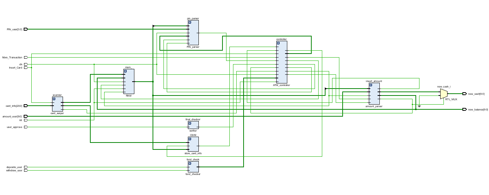
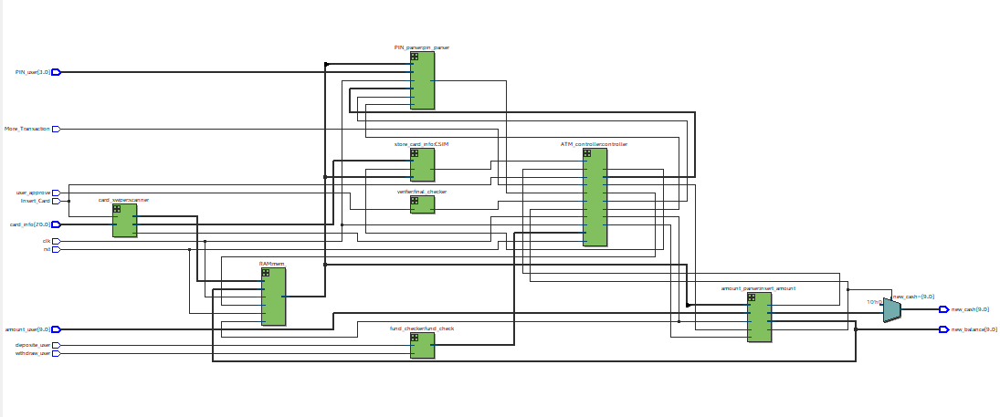
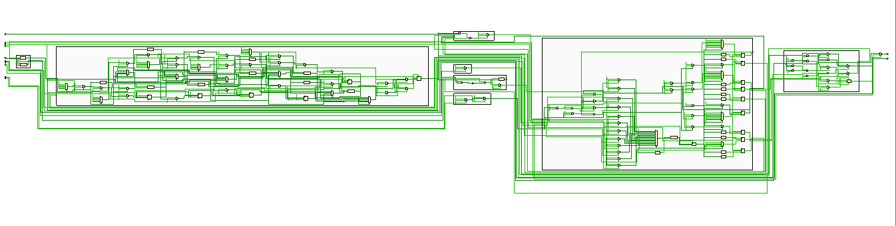

# ATM
## implement ATM bank core with Verilog HDL
 *Top Module*

## FSM 
 *Finite State Machine*
## Vivado RTL Schematic
 *Top Module*

## Quartus RTL Schematic
 *Top Module*

## Netlist Schematic 
 *Net-list*
